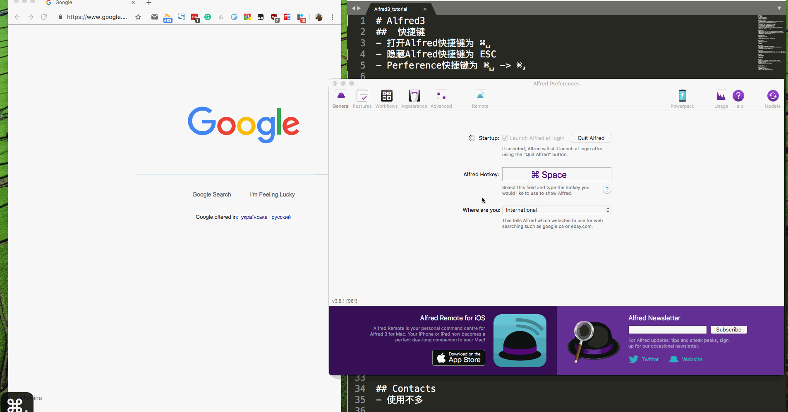
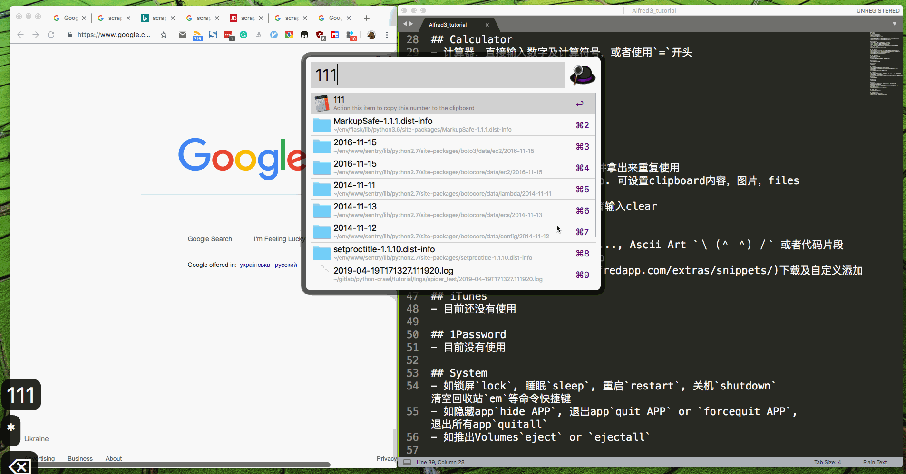
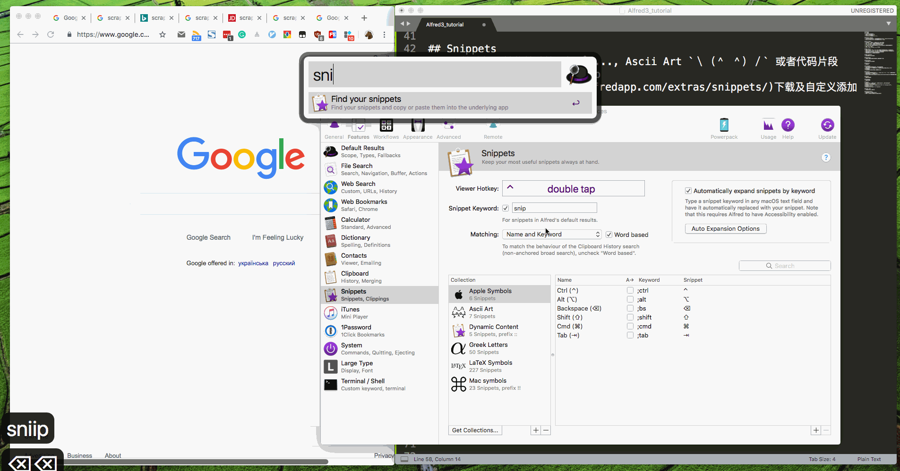

# alfred3-workflows
Some alfredworkflow files about Alfred3 and its show, [download Alfred3.x](https://xclient.info/s/alfred.html#versions)

## workflows
- Audio Recording.alfredworkflow  # record 快速打开录音
- Chrome Bookmarks.alfredworkflow # ,b  搜索浏览器标签页
- Colors.alfredworkflow  # colors  前端颜色
- Dash.alfredworkflow  # Dash 离线文档
- Display Brightness.alfredworkflow  # brightness  调整屏幕亮度
- GitHub.alfredworkflow  # 'gh' or 'gh my' or 'gh @' 快速搜索并进入github相关页
- Gitmoji.alfredworkflow  # gm  git commit时可使用的emoji :)
- IP Address v1.2.0.alfredworkflow # ip  快速显示内网与外网ip地址
- Linux.Command.alfredworkflow # lc 快速搜索linux command
- Launch in 3 browsers.alfredworkflow # test URL 在chrome, firefox, safari同时打开URL页面
- Mail.app Search.alfredworkflow # em or ... 搜索邮件
- Search.alfredworkflow  # ⌃s  快速搜索你已经选中的内容
- Show Desktop.alfredworkflow # show 快速显示空桌面
- StackOverflow.alfredworkflow # .so TEXT 进入stackoverflow搜索内容
- Sublime Text v1.1.alfredworkflow # 'subl' or 'subl***\* FILE' 使用subl模糊搜索并打开FILE文件
- V2EX.alfredworkflow # v2ex n  show v2ex当前内容
- Youdao.alfredworkflow # yd TEXT 使用Youdao进行翻译TEXT
- faker.alfredworkflow # faker 伪造一个地址或者人名...
- newfile.alfredworkflow # nf 在Findler快速创建文件
- terminalfinder.alfredworkflow # 'tf' or 'ft' Finder <=> iterm

## Alfred introduction
###  快捷键
- 打开Alfred快捷键为 ⌘␣

- 隐藏Alfred快捷键为 ESC

- Perference快捷键为 ⌘␣ -> ⌘,

  

### Default Results
- 打开各种已经安装的app, 及系统自带的如Contacts, System Preferences

- 在Finder打开Folders, 默认编辑器打开Text Files

  

### File Search
- 可以使用`'`, 或者`␣` 快速进入File Search模式

- open FILE_NAME, 使用默认编辑器打开FILE_NAME

- find FILE_ANME, 使用Finder打开FILE_NAME

- in SOME_TEXT, 搜索文件包含SOME_TEXT文本的文件，并用默认编辑器打开

- tags xx, # TODO

- COPY, MOVE, DELETE, ..., # TODO

  

### Web Search
- 自带如 google TEXT, bing TEXT 使用默认浏览器进行谷歌，必应搜索TEXT

- 自定义可添加如 g TEXT, jd BOOKS 使用默认浏览器进行谷歌，京东搜索某书本

- 或者直接输入大长串字符，默认使用google进行搜索

- 或者直接输入URL, 使用默认浏览器打开

  

### Web BookMarks
- 建议使用workflows代替

### Calculator
- 计算器，直接输入数字及计算符号，或者使用`=`开头

  

### Dictionary
- 建议使用workflows代替

### Contacts
- 使用不多

### Clipboard
- 用于记录前N次粘贴板里的内容，并拿出来重复使用

- 设置快捷键为 ⇧⇧, 或者输入clip. 可设置clipboard内容，图片，files list过期时间

- 可手动清空clipboard内容，或者输入clear

  

### Snippets
- 用于快速打开某些特殊符号如`å`..., Ascii Art `＼（＾ ＾）／` 或者代码片段

- 设置快捷键为 ⌃⌃, 或者输入snip

- 可去[snip](https://www.alfredapp.com/extras/snippets/)下载及自定义添加

  

### iTunes
- 目前还没有使用

### 1Password
- 目前没有使用

### System
- 如锁屏`lock`, 睡眠`sleep`, 重启`restart`, 关机`shutdown` 清空回收站`em`等命令快捷键

- 如隐藏app`hide APP`, 退出app`quit APP` or `forcequit APP`, 退出所有app`quitall`

- 如推出Volumes`eject` or `ejectall`

  

  

### Large Type
- 可设置字体大小，显示大小

### Terminal/Shell
- 配置使用Iterm2代替Terminal

- 使用`> COMMAND`快速在Iterm2输入命令行

  

