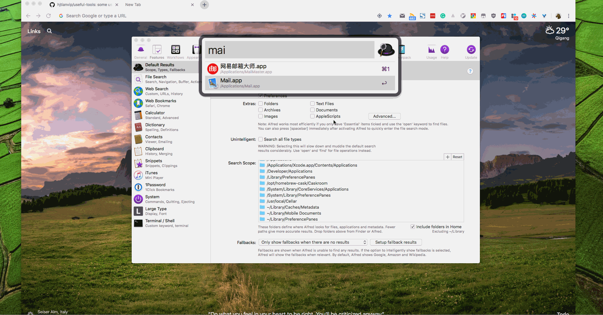
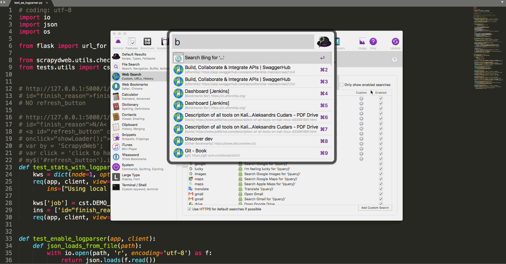
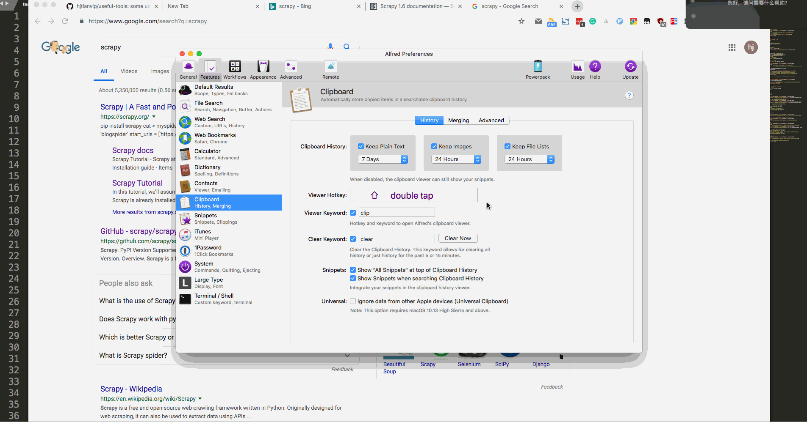
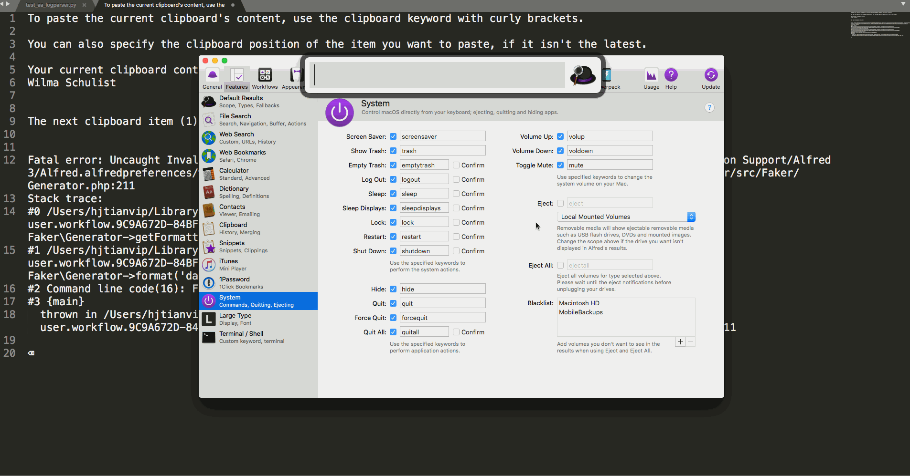
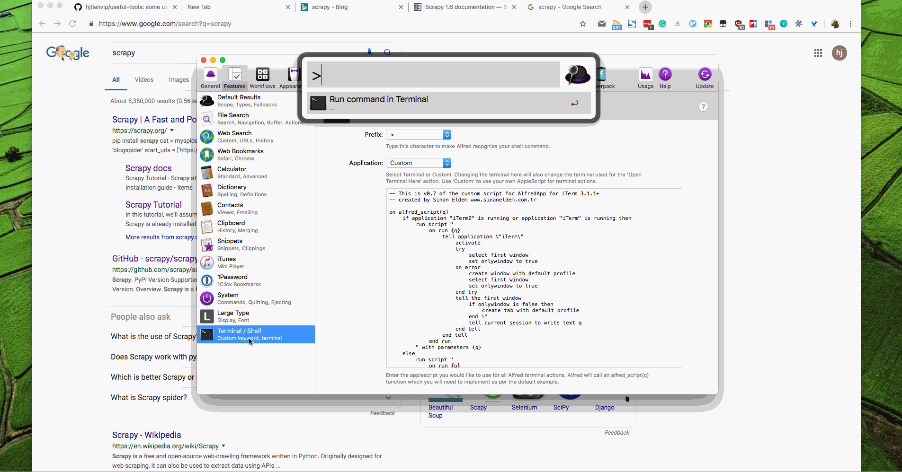

# alfred3-workflows
Some alfredworkflow files about Alfred3 and its show, [download Alfred3.x](https://xclient.info/s/alfred.html#versions)

## Alfred introduction

## workflows

- Audio Recording.alfredworkflow
- Chrome Bookmarks.alfredworkflow
- Colors.alfredworkflow
- Dash.alfredworkflow
- Display Brightness.alfredworkflow
- DuckDuckGo with Auto Suggestion.alfredworkflow
- GitHub.alfredworkflow
- Gitmoji.alfredworkflow
- IP Address v1.2.0.alfredworkflow
- Launch in 3 browsers.alfredworkflow
- Mail.app Search.alfredworkflow
- Search.alfredworkflow
- Show Desktop.alfredworkflow
- StackOverflow.alfredworkflow
- Sublime Text v1.1.alfredworkflow
- V2EX.alfredworkflow
- Youdao.alfredworkflow
- caffeinate.alfredworkflow
- faker.alfredworkflow
- moment.alfredworkflow
- network_info.alfredworkflow
- newfile.alfredworkflow
- terminalfinder.alfredworkflow
